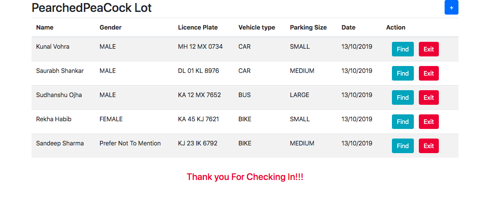
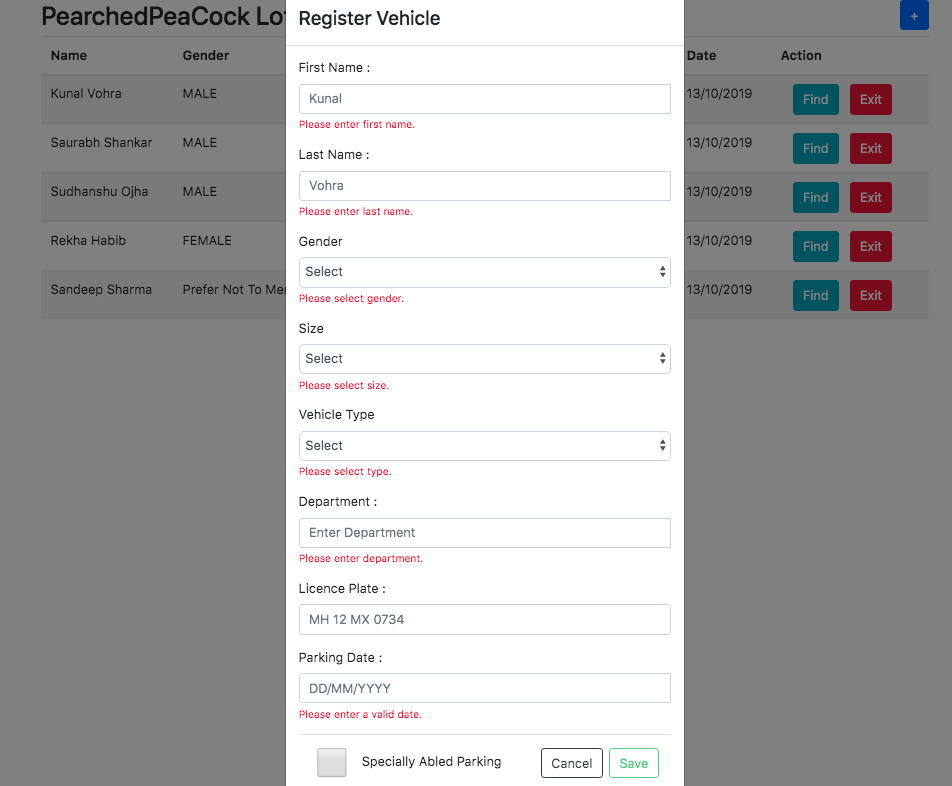
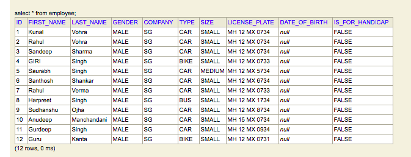

# Parking Demo

### Run Spring Boot App
```
   mvn spring-boot:run
```

### Run UI App
```
   cd parking-ui-app/
   ng serve --open --proxy-config proxy.conf.json
```
### Links

http://localhost:8081/swagger-ui.html<br>
http://localhost:8081/h2-console<br>

db: employee-db<br>
password : sa

###  NOTE
Pagination on ui not implemented(Api is paginated).<br> 
Test for ui is not written due to time constraint.


### Screenshots 







